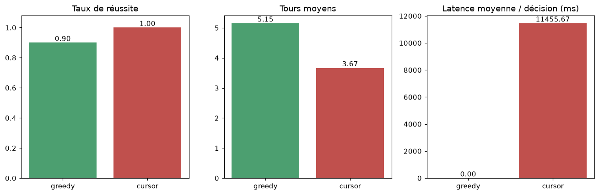

# npc_brain

Simulation d'un jeu sur grille où un PNJ doit ramasser de l'or. La décision de
déplacement peut être prise par :

- **`decide_greedy`** — cerveau déterministe (baseline, hors-ligne, instantané) ;
- **`decide_cursor_cli`** — un modèle **Cursor** via le CLI `cursor-agent` ;
- **`decide`** — un LLM compatible **OpenAI** (via `.env`).

Le tout est instrumenté : tableau de bord **en direct** (grille, décision,
latence, statut) et **métriques de performance** comparables entre cerveaux.

> 📓 Notes techniques et d'avancement détaillées : [`NOTES.md`](NOTES.md)
> (mécanismes, perception, déplacements, capacités des cerveaux, métriques).

## Arborescence

```
.
├── npc_brain.ipynb     # source de vérité : moteur + cerveaux + suivi/benchmark
├── visu.py             # visualisation en direct dans le terminal
├── tests/              # tests pytest (chargent le moteur depuis le notebook)
├── assets/             # visuels générés (ex. perf.png)
├── pyproject.toml      # dépendances (uv)
├── uv.lock
└── .env.example        # gabarit des variables d'environnement
```

## Installation (uv)

```bash
# https://docs.astral.sh/uv/ (curl -LsSf https://astral.sh/uv/install.sh | sh)
uv sync                 # crée .venv + installe toutes les dépendances
cp .env.example .env    # puis renseigner les clés si besoin (facultatif)
```

Le cerveau `greedy` fonctionne **sans aucune clé**. Pour les modèles :

- **Cursor** : `cursor-agent login` (aucune `CURSOR_API_KEY` requise) ;
- **OpenAI** : renseigner `LLM_API_URL` / `LLM_API_TOKEN` dans `.env`.

## Visualisation en direct (terminal)

```bash
uv run python visu.py                                   # greedy, carte de départ
uv run python visu.py --carte aleatoire --seed 7        # carte aléatoire
uv run python visu.py --objectif tout --pause 0.3       # ramasser TOUT l'or
uv run python visu.py --cerveau cursor                  # modèle Cursor (lent)
uv run python visu.py --carte aleatoire --taille 11 --n-or 6 --n-ennemis 3 --objectif tout
```

| Option | Rôle | Défaut |
|--------|------|--------|
| `--cerveau` | `greedy` \| `cursor` | `greedy` |
| `--carte` | `initiale` \| `aleatoire` | `initiale` |
| `--objectif` | `premier` (1er or) \| `tout` (tout l'or) | `premier` |
| `--max-turns` | plafond de tours | `30` |
| `--pause` | secondes entre deux tours | `0.5` |
| `--seed` / `--taille` / `--n-or` / `--n-ennemis` | génération de carte aléatoire | — |

## Notebook

```bash
uv run --with nbconvert jupyter nbconvert --to notebook --execute --inplace npc_brain.ipynb
```

Les cellules marquées `# [RUN]` lancent une simulation (elles sont ignorées par
les tests). La cellule *Benchmark* produit un graphique comparatif ; passer
`LANCER_BENCH_CURSOR = True` pour y inclure le modèle Cursor.



## Tests

```bash
uv run pytest              # toute la suite
uv run pytest -v           # détail test par test
uv run pytest -k perception
```

Les tests chargent directement les définitions du notebook `npc_brain.ipynb`
(pas de copie) : ils testent le vrai moteur, sans appel réseau.
